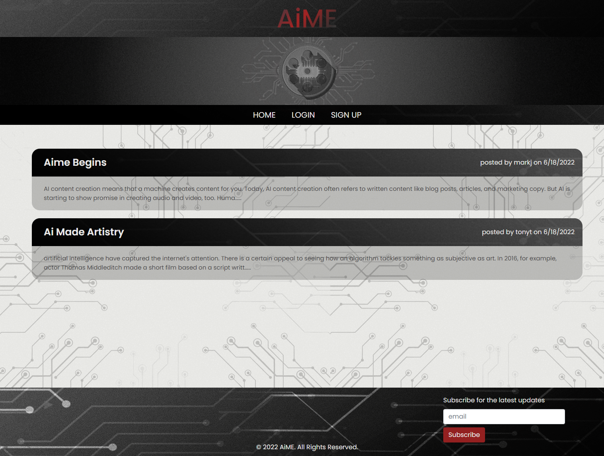

# AiME News - Tech Blog

## Description

Competition is tough for companies operating in the internet retail space and they need websites that use the latest back end technologies to power their E-commerce in order to keep pace.

Enter the purpose of this project: utilize Node.js, Express.js, MySQL, and Sequelize to create a back end application to manage a company's inventory database. The application is easily installed and initialized, and includes the following features:

- Once the user logs into MySQL and connects to the database, they are able to enter the schema and can then seed the database with test data
- Once the user initializes the server, the Sequelize models are synced to the database
- The user is then able to utilize API GET routes to retrieve data for their inventory's 'categories', 'products', or 'tags'
- The user is also able to utilize API POST, PUT, and DELETE routes to create, update, and delete data from the database

Being able to retrieve, add, and modify data is a critical aspect of running any E-commerce business, and the functionality enabled by this application allows that to happen.



The deployed site can be found at https://aime-news.herokuapp.com.


## Installation

To install this application, first clone the repo to your local machine. Then, you will need to install the node dependencies/modules which can be done by running the ```npm install``` command in your terminal/bash shell. 

## Usage

To use this application, you first need to have MySQL installed, and then initialize the database with the following command:

```
mysql -u root -p
``` 
Next, enter your password for MySQL. Once you are in your server run: 
```
SOURCE db/schema.sql
quit
``` 
Then run:
```
npm run seeds
```
Finally, initialize the server: 
```
nodemon server.js


## Credits

Collaborators include the instructor, TAs, and fellow classmates of the UCF Coding Bootcamp (Spring 2022).


## License

Copyright (c) 2022 Vik Maharaj

Permission is hereby granted, free of charge, to any person obtaining a copy of this software and associated documentation files (the "Software"), to deal
in the Software without restriction, including without limitation the rights to use, copy, modify, merge, publish, distribute, sublicense, and/or sell copies of the Software, and to permit persons to whom the Software is furnished to do so, subject to the following conditions:

The above copyright notice and this permission notice shall be included in all copies or substantial portions of the Software.

THE SOFTWARE IS PROVIDED "AS IS", WITHOUT WARRANTY OF ANY KIND, EXPRESS OR IMPLIED, INCLUDING BUT NOT LIMITED TO THE WARRANTIES OF MERCHANTABILITY,
FITNESS FOR A PARTICULAR PURPOSE AND NONINFRINGEMENT. IN NO EVENT SHALL THE AUTHORS OR COPYRIGHT HOLDERS BE LIABLE FOR ANY CLAIM, DAMAGES OR OTHER LIABILITY, WHETHER IN AN ACTION OF CONTRACT, TORT OR OTHERWISE, ARISING FROM, OUT OF OR IN CONNECTION WITH THE SOFTWARE OR THE USE OR OTHER DEALINGS IN THE SOFTWARE.


## Badges


[](https://opensource.org/licenses/MIT)